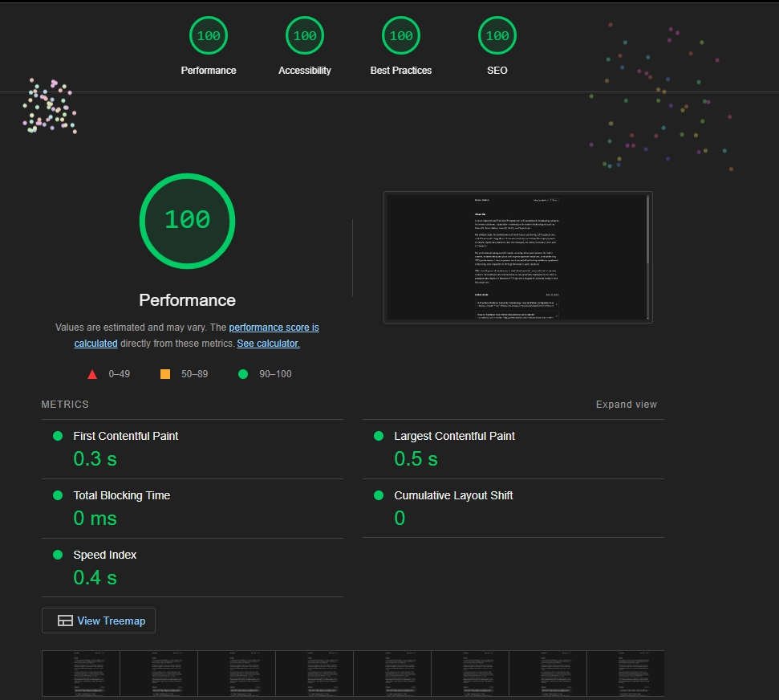

[](https://choosealicense.com/licenses/mit/) 

# Personal Website
My personal website where I post my Articles and Open Source Projects.

## Usage

First, run the development server:

```bash
npm run dev
# or
yarn dev
# or
pnpm dev
# or
bun dev
```

Open [http://localhost:3000](http://localhost:3000) with your browser to see the result.

## Page Insights



## Technologies used in this project

| Name                | Description                                                                                                                        |
|---------------------|------------------------------------------------------------------------------------------------------------------------------------|
| [Next.js](https://nextjs.org/)                                        | Next.js is a popular React framework that offers static generation, SSR, etc.    |
| [Tailwind CSS](https://tailwindcss.com/)                              | A utility-first CSS framework packed with classes like flex, pt-4, text-center and rotate-90 that can be composed to build any design, directly in your markup.  |
| [Node.js](https://nodejs.org/en)                                      | Node.js is a Javascript runtime build on Chrome`s V8 JavaScript                  |
| [Typescript](https://www.typescriptlang.org)                          | Typescript extends JavaScript by adding types to the language                    |
